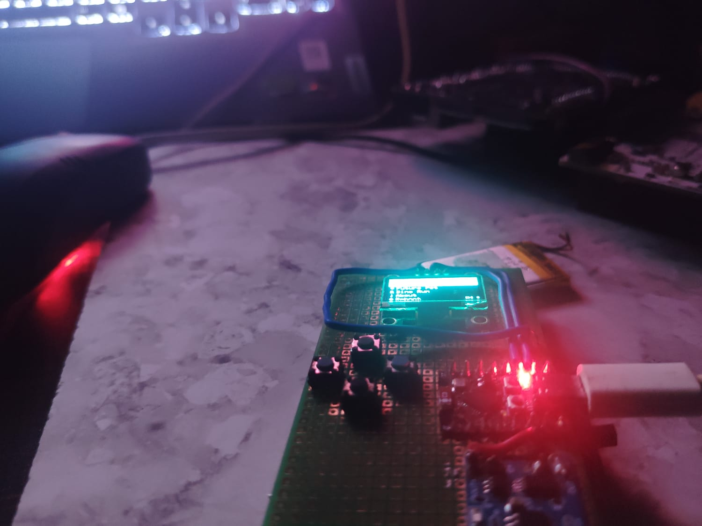
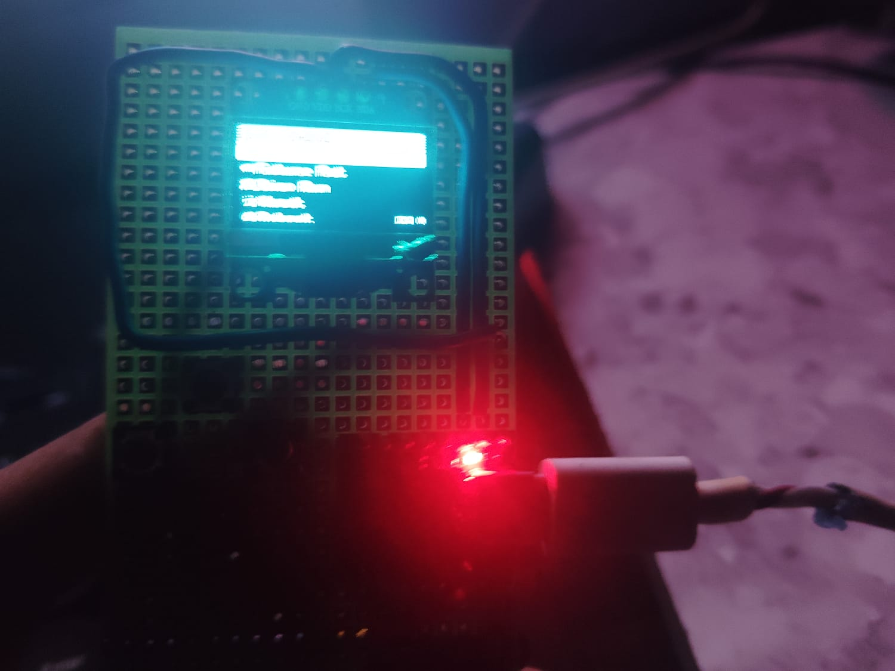

This repo is not maintained and might not recieve constant pull request the current remote that is active is https://codeberg.org/grayveyardends/Smart_Event_Card

# Smart_event_card

Smart Event Card
done

This project is a wearable card you can carry at a physical event, like a conference, festival, or race. It is meant to make the event feel more interactive and to help you keep track of what you have done during the day.

The card can send you notifications during the event. It can also track your movement and progress using a mesh based location system, similar to how Apple AirTags work. As you move around, your card talks to other devices nearby and helps build a picture of where you have been and what areas you have visited.

There is also a server side to this project. The server keeps a list of all the tracks and events happening, along with the areas they cover, so you can see everything going on in one place.

Why I built this

I wanted to explore how small embedded devices, mesh networking, and a backend server could work together to make a physical event feel more connected. Instead of checking a phone app the whole time, the idea is that the card itself becomes your way of interacting with the event.

How it works

The card is built around a small microcontroller running C++ code, using PlatformIO for the build setup. It communicates with nearby cards and base stations using a mesh network, which lets devices pass information along without needing a constant direct connection to the internet. This information is sent up to a server, which keeps track of where cards have been and matches that against the event's tracks and areas.

Project structure

The code is organized into a few main folders. The src folder holds the main source code for the device. The include folder holds shared headers. The test folder has tests for parts of the code. The assets folder has images and other media related to the project.

Status

This is a personal project and still a work in progress. Some parts are more finished than others, and I am continuing to improve the mesh tracking and server side over time. The actively developed version of this project now lives on Codeberg, and this GitHub copy may not always be fully up to date.
